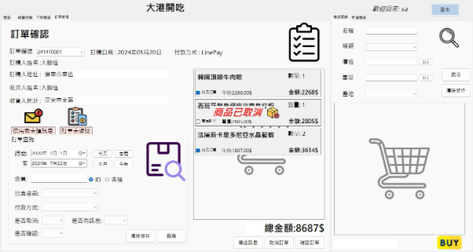

# 海鮮肉品商店

### 專案簡介

海鮮肉品商店是一個簡單的商店概念雛形，使用 WinForms 和 MSSQL 技術開發。此應用程式旨在模擬線上或實體商店的運作，並提供基礎的商店管理功能。

### 功能清單

- **購物車**：讓用戶可以將商品加入購物車，進行多筆購物並結帳。
- **會員系統**：用戶可以註冊、登入並管理個人帳戶資訊。
- **商品管理**：提供商品新增、修改、刪除和管理功能。
- **購買紀錄**：保存所有購買交易記錄，供會員查詢過往購買資訊。
- **訂單系統**：處理訂單的建立與管理，包括確認、修改及取消訂單等功能。

### 技術架構

- **開發平台**: Windows Forms (.Net Framework 4.8.0)
- **資料庫**: Microsoft SQL Server (MSSQL)

### 安裝步驟

1. **下載專案**：從 GitHub 存儲庫下載此專案。
2. **設置資料庫**：在 MSSQL 中建立資料庫，並導入專案中提供的資料庫腳本以初始化資料庫。
3. **配置應用**：在跟目錄創建一個connString.txt放入資料庫連接字串，以連接到 MSSQL 資料庫。

### 使用方法
- 用戶可以註冊帳戶，登入後開始購買商品。
- 商品可以通過商品管理功能進行新增和修改。
- 購物過程中，商品會被加入購物車，並可通過訂單系統進行結帳。
- 用戶可隨時查看自己的購買紀錄。
- 管理員帳號:sa 密:asdasd

